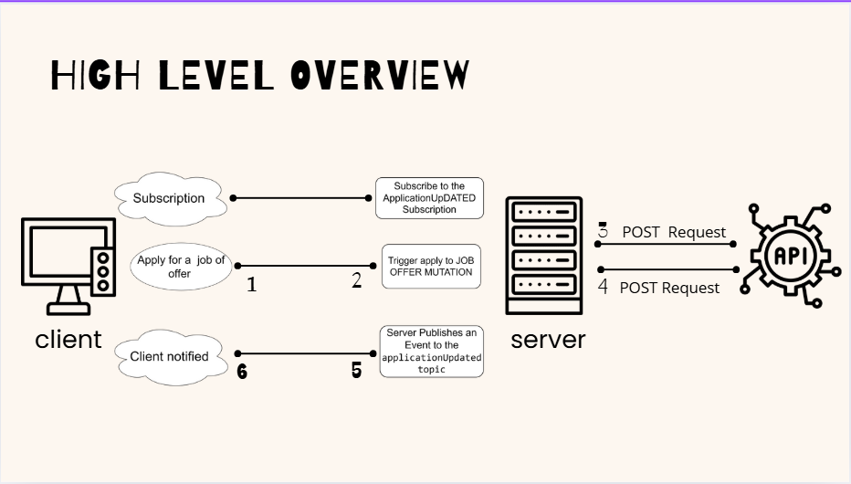

## Project Resume

This API leverages FastAPI to process resumes and job descriptions, analyze their content, and calculate a compatibility score based on extracted skills, majors, and degrees. Key functionalities include:

1- File Upload Endpoint:
Allows uploading and storing files via a Base64-encoded payload.

2- Resume Analysis Endpoint:
Analyzes a given resume file and a job description string to: - Translate content as needed. - Extract and compare skills, majors, and degrees.
-Calculate a compatibility score using semantic similarity and predefined rules.
3- AI and NLP Integration:
Uses advanced processing techniques, including: - Entity extraction for skills, majors, and degrees. - Semantic similarity using SBERT-based models. - Pattern matching with predefined JSON files.
4- Scoring System:
Evaluates compatibility based on: - Skill match percentage. - Major alignment. - Degree qualification comparison.

==> This project is ideal for streamlining recruitment processes by automating candidate-job compatibility assessment. It demonstrates a robust integration of FastAPI, NLP, and machine learning techniques.

## Setup Instructions

Before running the project, it's necessary to set up a virtual environment with the required dependencies. Follow the steps below to create the virtual environment and install the necessary libraries: **Dockefile will be provided soon for easy environment setup**

1.  **Create Virtual Environment:** Open your terminal or command prompt and navigate to the project directory.

    ```bash
    python -m venv venv
    ```

    This command will create a virtual environment named `venv` in your project directory.

2.  **Activate Virtual Environment:** Activate the virtual environment.

    - **On Windows:**

      ```bash
      venv\Scripts\activate
      ```

    - **On macOS and Linux:**
      ```bash
      source venv/bin/activate
      ```

3.  **Install Dependencies:** Once the virtual environment is activated, install the required libraries using pip.

    ```bash
    pip install -r AI/model_loading/requirements.txt
    ```

    The `requirements.txt` file is located in the `model_loading` folder under the `AI` directory.

4.  **Run Notebook:** After installing the dependencies, you can run the project notebook locally.

    ```bash
    jupyter notebook Translation.ipynb
    ```

    Replace `Translation.ipynb` with the actual name of your notebook file.

5.  **Alternatively, Run Notebook in Google Colab:** You can also run the project notebook in Google Colab. After running the notebook and generating the `.pkl` file, download it and copy it into the project directory.

        - Open the notebook in Google Colab.
        - Run the notebook cells.
        - After generating the `.pkl` file, download it.
        - Copy the downloaded `.pkl` file into the project directory.

6.  **Inside the function: translate_from_french_to_english** - Replace with the path of the downladed .pkl model
